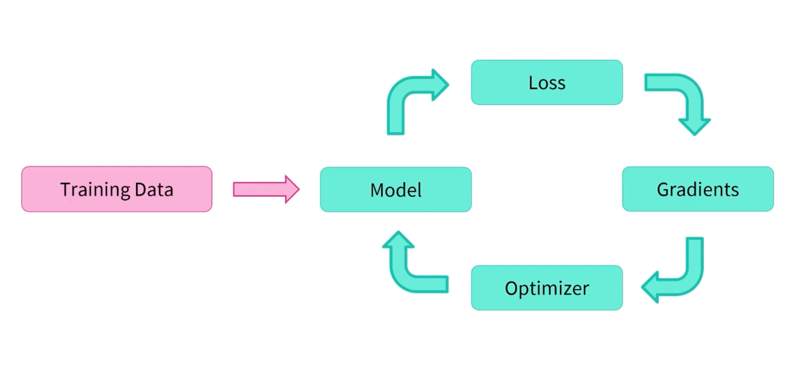

# PyTorch OD Training Pipeline with Built-in Visualization
> created by Zihan Pan -- Sep.17 2023


## Table of Contents
- [Overview](#overview)
- [Installation](#installation)
- [Usage](#usage)
- [Common Issues](#common-issues--debugging)

## Overview

This PyTorch training pipeline is designed to streamline the process of training deep learning models. It includes components for data loading, model creation, training, and evaluation. Additionally, it integrates with W&B for comprehensive experiment tracking and visualization of training metrics.

## Installation

1. Clone the repository:

   ```bash
   git clone https://e.coding.net/beautysaas/deeplearningpipeline/DeepLearningPipeline.git
   cd DeepLearningPipeline
   ```

2. Install the required Python packages. It's recommended to create a virtual environment before installing dependencies:

   ```bash
   pip install -r requirements.txt
   ```

## Usage
### Training


To start training your deep learning model, follow these steps:

1. Ensure you have configured the `config` dictionary and have valid `dataset` in this format:
   - **DataSet**
     - **train**
       - label1
       - label2
       - label3
       - ...
     - **val**
       - label1
       - label2
       - label3
       - ...

2. Ensure you have setup the `config` in `train.py` script:

    ```python
    config = dict(
        epochs=30, # iteration epochs
        classes=4, # number of classes to be predicted
        batch_size=32, # batch size per training
        step_size=5, # learning rate step size
        gamma=0.5, # learning rate gamma ratio
        dataset_dir='DataSet' # dataset directory (from root)
    )
    ```
   
3. Load your model architecture and corresponding weights:
    ```python
    # Load a pretrained model and default weights
    from torchvision.models import densenet161, DenseNet161_Weights
    model = densenet161(weights=DenseNet161_Weights.IMAGENET1K_V1).to(device)
    # Change the full connection layer to match the classed you want to predict
    model.classifier = nn.Linear(model.classifier.in_features, config['classes']) 
    ```
    - This code will train from `ImageNet1000` pretrained-weights
    ```python
    # Load a pretrained model
    from torchvision.models import resnet101
    model = resnet101()
    model.fc = nn.Linear(model.fc.in_features, config['classes'])

    # Load the saved model weights
    model.load_state_dict(torch.load('Checkpoint/Deployed CV Model/ResNet 101/best-0.188.pth'))
    ```
   - This code will perform `online-training` that continues to train on your dataset
   - Make sure your model architecture matches the pre-trained weights.
4. Run the training pipeline by executing the `train.py` script:

   ```bash
   python ExampleResnet101.py
   ```
   or
   ```bash
    python ExampleDenseNet161.py
   ```

5. This will initiate the training process. W&B will log and visualize training metrics, including loss, accuracy, precision, recall, and F1-score, in real-time.

6. Monitor the training progress in your W&B project dashboard.
   
### Inferencing
To make inference based on the pretrained weights, follow these steps:
1. Ensure you load the same model architecture and have valid `.pth` trained weights in checkpoint folder

2. Run the training pipeline by executing the `inference.py` script:
    ```bash
   python ExampleInferenceResnet101.py
    ```
   or
    ```bash
    python ExampleInferenceDenseNet161.py
    ```

3. This will initiate the inferring process.

#### GPU Backend
The choice of GPU or CPU depends on various factors, including the availability of GPU hardware.


For **MacOS**, MPS stands for the GPU device.
```python
# Call GPU backend
device = torch.device("mps" if torch.has_mps else "cpu")
```

For **NVidia**, you may want to change the code to use 'cuda' instead:
```python
# Call GPU backend
device = torch.device("cuda")
```

---

## Common Issues & Debugging
### SSH Error

To fix the `SSLCertVerificationError` issue while loading pre-treained model/dataset from an url, open terminal:
```
pip install --upgrade certifi
```
